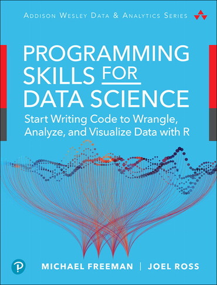

<h6>ver. Aug-2021.</h6>
<h2>DCS-510 "Foundations of Data Science" </h2>
<h4 style="color:green"><i> Prof. Sangmork "SAM" Park (Col(R). ROKAF)</i></h4>
<h5><u><i>School of Arts and Science, Carolina University</i></u></h5>

<h4>Textbook:</h4> 

<em><u>[Michael Freeman and Joel Ross, 2018. "Programming Skills for DATA SCIENCE", Addison-Wesley Professional](https://www.pearson.com/en-us/subject-catalog/p/programming-skills-for-data-science-start-writing-code-to-wrangle-analyze-and-visualize-data-with-r/P200000009475/9780135133101)</u></em>

<h4>Prerequisites (Not the requirment but recommended):</h4>

-   Basic skills on Programming (R-programming)
-   Basic knowledge on Relational Database

<!-- ---

<h4>Course description</h4>
---  -->

<h4>Course Schedule</h4>

<h5>Week-1: </h5>

-   Setting Up Lab Environment
    -   Installing git and GitHub Account Creation
    -   Download the R Language and RStudio
-   The Command Line for Programming
-   Quiz#1, Project#1 (Lab environment setup)

<h5>Week-2: </h5>

-   Version control with git and GitHub
-   Markdown for Documentation
-   Quiz#2, Rearch#1

<h5>Week-3: </h5>

-   Introduction to R Programming
-   Libraries and APIs
    -   Functions
    -   Vectors
    -   Lists
-   Quiz#3, Report#2

<h5>Week-4: </h5>

-   Data Wrangling
    -   Understanding Data
    -   Data Frames
    -   Manipulation / Reshaping Data (dplyr / tidyr)
-   Mid-term exam, Report#3

<h5>Week-5: </h5>

-   Database
    -   DBMS (Sqlite)
    -   SQL (Structured Query Language)
-   Web APIs
-   Quiz#4, Report#4

<h5>Week-6: </h5>

-   Data Visualizations
    -   Data Visualization Design
    -   Data Visualizations with ggplot2
    -   Interactive Visualization in R
-   Quiz#5, Report#5

<h5>Week-7: </h5>

-   Building and Sharing Applications
    -   Dynamic Reports with R Markdown
    -   Building Interactive Web Applications with Shiny
-   Working Collaboratively
    -   Version Control and Branches
    -   Collaboration with Centralized/Forking Workflow
-   Final exam, Final Project/Report

---

<h4>References</h4>

-   [A short Course in R (Washington.edu)](https://faculty.washington.edu/tlumley/Rcourse/)
